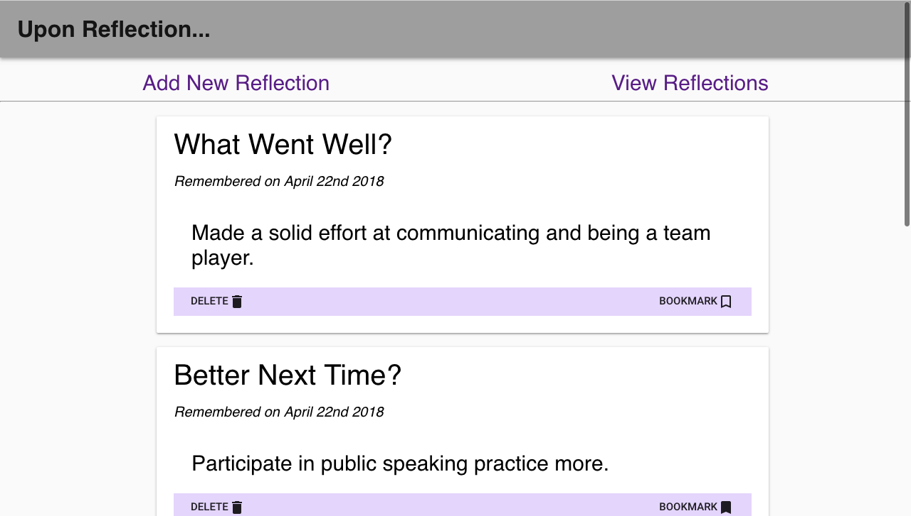

# OH, THE PLACES WE'VE BEEN

Reflection is such an important part of growth. As you do grow, being mindful and appreciating the path you've traveled to get where you are is crucial. How do you know of your accomplishments if you don't reflect on the steps you took to succeed, and the times you stumbled along the way? This app is just a nice little way to jot down some of your memories to look back on later with all your other moments. 

### ADD NEW REFLECTION

The landing page takes you to the form to save a reflection. Think of it as a quick journal entry. Anytime you remember something, you've got two inputs, topic and description, to enter what you need to. Then just click the 'Remember' button to save it.

### VIEW REFLECTIONS

The other side of the app we have the View Reflections page. Here you have a list of all the 'reflections' that have been saved. The topic, description, date entered, and displayed from newest to oldest. You can delete any of the items, or bookmark to show which ones were most important to you.

## TECH USED

- React.js
- Redux
- Material-UI
- PostgreSQL
- Node.js
- Express
- moment.js
- sweetalert.js
